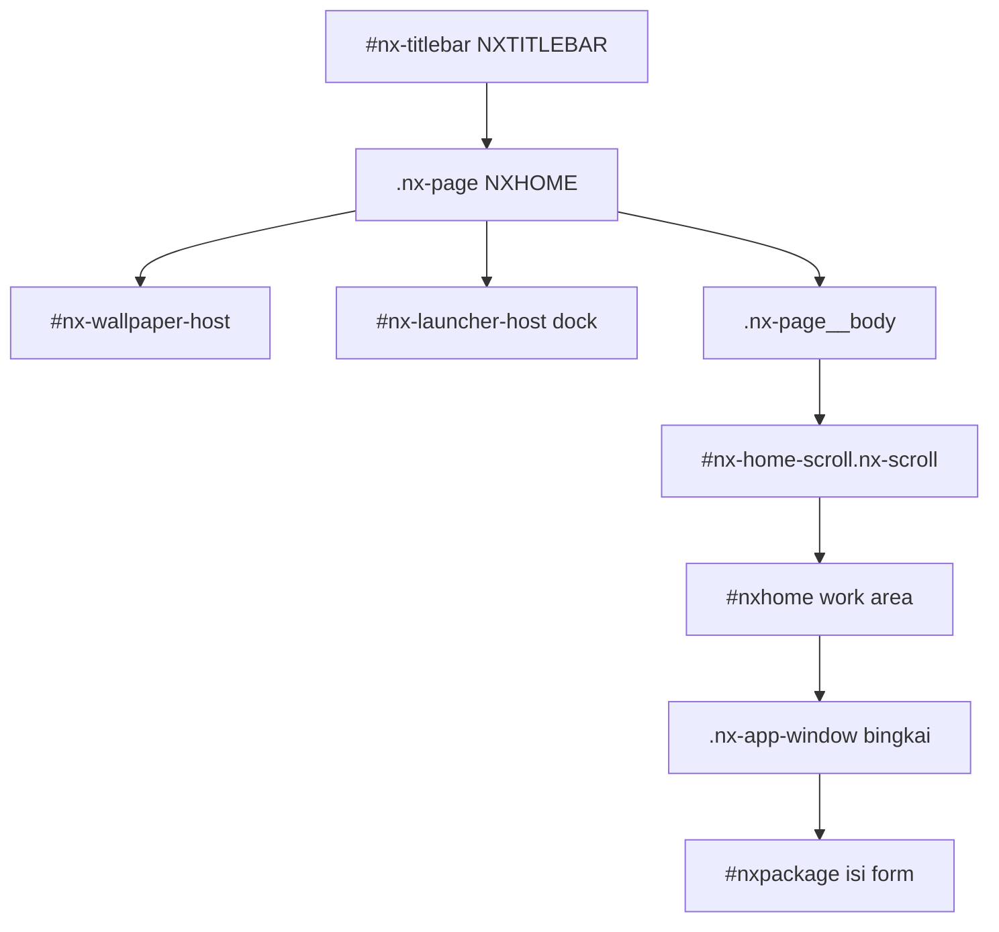

# `system/window/` — Area kerja & bingkai app window

Dokumentasi **keadaan sebelumnya** (referensi `screenshot/a5.png`) dan **kontrak bingkai floating** di dalam area kerja: minimize / maximize / restore, drag, resize.

**Bukan** Electron `BrowserWindow` dan **bukan** titlebar shell (`system/titlebar/` / `#nx-titlebar`).

> Implementasi hidup di `index.js`, `style.css`, `settings.js` (tema visual).  
> Tema UI: Settings → Window (`package/settings/stwindow.js`).  
> Ringkasan panel settings: `package/settings/README.md`.

---

## 1. Tujuan

`system/window/` = **bingkai app di work area** (bukan frame OS).

| Yang diatur di sini | Yang **tidak** di sini |
|---------------------|-------------------------|
| Frame app di dalam `#nxhome` / work area | Titlebar Electron (min/max/close OS) |
| Drag, resize, minimize, maximize, restore, close-app | Dock launcher (`system/shortcut/`) |
| Body scroll di dalam bingkai | Wallpaper layer (`system/utilities/wallpaper`) |
| Batas geometri vs pad launcher | Routing package (`#package/…`) — hanya dikonsumsi |

Keputusan UI:

- Chrome window: title + kontrol **min / max (maximize) / close** (close = tutup ke home / unload package — **bukan** Electron `windowClose`).
- Geometri user: **drag** title bar, **resize** dari tepi/sudut, dalam batas work area (`#nx-home-scroll` / `#nxhome`).
- Maximize = isi penuh work area (bukan fullscreen OS); restore = ukuran/posisi terakhir.
- Minimize = sembunyikan body window (atau collapse); restore mengembalikan geometry.
- Wallpaper + launcher tetap di belakang/tepi; window mengambang di atas wallpaper.

---

## 2. Diagram lapisan + istilah

### 2.1 Keadaan bermasalah (audit a5 / sebelum bingkai)

```text
#nx-titlebar          ← NXTITLEBAR (shell Electron)
.nx-page (NXHOME)     ← index.js
  #nx-wallpaper-host
  #nx-launcher-host   ← dock overlay
  .nx-page__body
    #nx-home-scroll.nx-scroll
      #nxhome
        package/settings → <article class="nx-page">   ← nested .nx-page
          link nav pipe (launcher | Wallpaper | …)
          #nxpackage → form Wallpaper
```

### 2.2 Target (dengan bingkai)

```text
#nx-titlebar
.nx-page (NXHOME)
  #nx-wallpaper-host
  #nx-launcher-host
  .nx-page__body
    #nx-home-scroll.nx-scroll     ← WORK AREA (batas drag/resize)
      #nxhome
        .nx-app-window            ← BINGKAI (system/window)
          .nx-app-window__header  ← title + min / max / close
          .nx-app-window__body.nx-scroll
            #nxpackage / isi app  ← tanpa nested .nx-page desktop
```



| Layer | File | Peran |
|-------|------|--------|
| Titlebar shell | `system/titlebar/` | Chrome Electron (min/max/close OS) — **bukan** bingkai app |
| Desktop NXHOME | `templates/distro/Development/index.js` | wallpaper + launcher + `#nxhome` |
| Work area | `#nxhome` / `#nx-home-scroll` | Batas drag/resize window app |
| App window | `system/window/` | Bingkai floating + kontrol min/max/maximize |
| Konten (a5) | `package/settings/` | Dulu: nested `.nx-page` full tanpa bingkai |

### 2.3 Istilah

| Istilah | Arti |
|---------|------|
| **Shell chrome** | `#nx-titlebar` — kontrol jendela OS |
| **Desktop** | `.nx-page` NXHOME: wallpaper + launcher + work area |
| **Work area** | `#nx-home-scroll` / `#nxhome` — kotak tempat window app hidup |
| **App window** | `.nx-app-window` — bingkai floating satu package/app |
| **Nested fill** | `#nxpackage` atau konten route di dalam body window |

---

## 3. Audit `screenshot/a5.png`

Referensi: settings **Wallpaper** (lingkaran merah di screenshot) di atas desktop Development.

1. **Tanpa bingkai window** — panel abu penuh menutup wallpaper; tidak terasa “jendela di desktop”.
2. **Nested `.nx-page`** — shell settings memakai class desktop → padding / overflow / kontrak tinggi bentrok dengan NXHOME.
3. **Chrome app absen** — tidak ada title bar app (min/max/close); navigasi = `launcher | Wallpaper | components | …` mentah.
4. **Konten terpotong** — kontrol bawah (Blur / Opacity / Color) keluar viewport; tidak ada body scroll **di dalam** frame tetap.
5. **Tidak bisa digeser / diubah ukuran** — user tidak punya kontrol geometri di work area.

Penyebab struktural: package di-render sebagai halaman penuh di `#nxhome`, bukan sebagai instance `.nx-app-window`.

---

## 4. Kontrak target bingkai

### 4.1 Markup

```html
<div class="nx-app-window" data-state="normal" data-app="settings"
     style="left:…; top:…; width:…; height:…">
  <header class="nx-app-window__header">
    <span class="nx-app-window__title">Settings</span>
    <div class="nx-app-window__controls">
      <button type="button" data-nx-app="minimize" aria-label="Minimize"></button>
      <button type="button" data-nx-app="maximize" aria-label="Maximize"></button>
      <button type="button" data-nx-app="close" aria-label="Close"></button>
    </div>
  </header>
  <div class="nx-app-window__body nx-scroll">
    <!-- chrome app: nav tabs settings (opsional) -->
    <div id="nxpackage"><!-- isi route nested --></div>
  </div>
  <!-- resize handles: n, e, s, w, ne, nw, se, sw -->
</div>
```

- Body **wajib** `.nx-scroll` (kontrak distro / kernel scroll) — scroll isi form **hanya** di sini.
- Form settings **tidak** memakai `<article class="nx-page">` desktop; pakai layout di dalam body window (mis. `.ubuntu-workbench`).

### 4.2 State

| State | Perilaku |
|-------|----------|
| `normal` | Posisi + ukuran user; drag + resize aktif |
| `maximized` | Isi **penuh work area** (inset 0 relatif bounds work area). **Bukan** maximize Electron. Tombol max → restore ke `normal`. |
| `minimized` | Body disembunyikan; restore mengembalikan state **sebelum** minimize (`normal` **atau** `maximized`). |

Geometry `normal` terakhir disimpan saat maximize/minimize supaya un-maximize akurat.  
Target restore setelah minimize dicatat di `data-restore-to` + WeakMap (`restoreTargetByEl`) — tanpa ini, maximize→minimize→restore jatuh ke ukuran normal (“flat”) dan kehilangan mode maximize.

### 4.3 Kontrol (beda dengan titlebar shell)

| Kontrol | App window (`data-nx-app`) | Shell (`data-nx-win`) |
|---------|----------------------------|------------------------|
| Minimize | Collapse / hide window app | `electronAPI.windowMinimize` |
| Maximize | Toggle isi work area | `electronAPI.windowMaximizeToggle` |
| Close | Tutup app → `#distro/home` / kosongkan window | `electronAPI.windowClose` |

**Jangan** panggil `windowClose` Electron dari tombol close app window.

### 4.4 Drag & resize

- **Drag**: pointer down di `.nx-app-window__header` (bukan di tombol kontrol).
- **Resize**: handle tepi/sudut; min-width / min-height di CSS.
- **Clamp**: seluruh box tetap di dalam work area (`#nxhome` / `#nx-home-scroll`).
- Saat `maximized`: drag/resize nonaktif sampai restore.

### 4.5 Persistensi

- Store DistroBuckets: `nx-window` (lihat `system/index.js` / buckets version).
- Per app id: `{ left, top, width, height, state }` (+ prefs tema terpisah `__prefs__`).
- Default geometry: relatif work area, centered — jika belom ada prefs.

### 4.6 Multi-window

Fase awal: satu window aktif.  
Fase lanjut: z-index stack, focus click-to-front, badge launcher — jangan bentrok desain header.

### 4.7 Tinggi & scroll (wajib)

Selaras `Development/README.md` § scroll:

1. Work area tinggi dihitung NXHOME (`NXUI.Window.height() − top` pada `#nx-home-scroll`).
2. App window ukuran relatif work area — **jangan** `100vh` untuk body form.
3. Isi panjang scroll di `.nx-app-window__body.nx-scroll`.
4. Komponen scroll internal (editor, dll.) jangan diganda dengan scroll body window yang ikut menggulung header.

---

## 5. Pemetaan file

| File | Peran |
|------|--------|
| `system/window/README.md` | Dokumen ini (analisis + kontrak) |
| `system/window/style.css` | `.nx-app-window`, header, handles, states, tema |
| `system/window/index.js` | `openAppWindow`, `setAppWindowState`, drag/resize, persist; assign `window.*` dari `system/index.js` |
| `system/window/settings.js` | Prefs tema visual bingkai (`nx-window` / `__prefs__`) |
| `package/settings/index.js` | Shell tanpa nested `.nx-page`; nav di dalam body window |
| `templates/workspace.css` | `@import` style window saat regenerasi / manual |

API (kontrak `window.*` — package **tidak** import path relatif ke `system/window`):

```js
// window.openAppWindow({ id, title, mount, … })
// window.setAppWindowState('maximized' | 'minimized' | 'normal')
// window.closeAppWindow()
// window.prepareAppWindowContainer / attachAutoAppWindow / …
```

---

## 6. Non-goals

- Mengganti atau menduplikasi `system/titlebar` / frame Electron.
- Memindahkan launcher atau wallpaper ke modul window.
- Window manager multi-desktop / snap Windows 11 lengkap (fase jauh).
- Mengubah kernel `grafis.js` kecuali hook mount work area yang memang perlu.

---

## 7. Ringkasan keputusan

1. Area kerja = `#nx-home-scroll` / `#nxhome` di belakang dock/wallpaper.
2. Isi package = **bingkai floating** dengan min / maximize / restore / close-app.
3. User **menarik (drag)** dan **mengubah ukuran**, di-clamp ke work area.
4. Maximize = penuh work area, bukan OS maximize.
5. Scroll form di **body bingkai**; hilangkan nested `.nx-page` desktop di shell settings.
6. Close app window ≠ `electronAPI.windowClose`.
