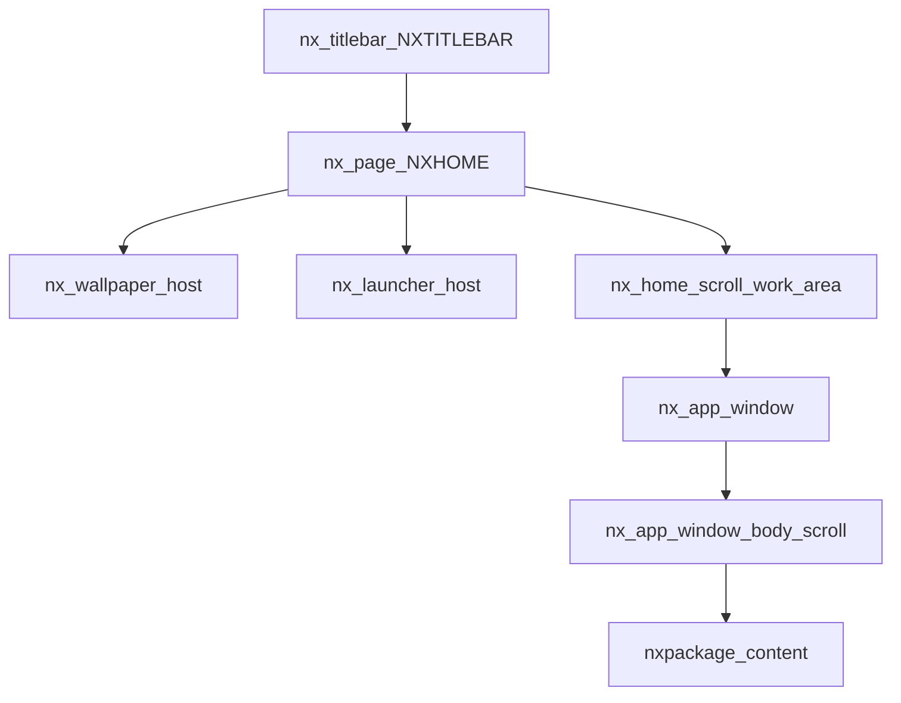

# `system/window/` — Area kerja & bingkai app window

Kontrak **work area** di dalam NXHOME dan **bingkai jendela aplikasi** (floating) yang bisa digeser / diubah ukuran / min–max.  
**Bukan** Electron `BrowserWindow` dan **bukan** titlebar shell (`system/titlebar/` / `#nx-titlebar`).

Status dokumen: **spesifikasi + implementasi awal** (`index.js`, `style.css` sudah ada).

Referensi visual masalah sebelumnya: `screenshot/a5.png`.

---

## 1. Tujuan

| Yang diatur di sini | Yang **tidak** di sini |
|---------------------|-------------------------|
| Frame app di dalam `#nxhome` / work area | Titlebar Electron (min/max/close OS) |
| Drag, resize, minimize, maximize, restore, close-app | Dock launcher (`system/shortcut/`) |
| Body scroll di dalam bingkai | Wallpaper layer (`system/utilities/wallpaper`) |
| Batas geometri vs pad launcher | Routing package (`#package/…`) — hanya dikonsumsi |

User melihat wallpaper + dock di belakang; **isi package** (settings, dll.) hidup di **satu jendela mengambang** yang rapi, bukan panel full-bleed menempel tepi.

---

## 2. Lapisan (sekarang vs target)

### 2.1 Sekarang (audit kode)

```text
#nx-titlebar          ← NXTITLEBAR (shell Electron)
.nx-page (NXHOME)     ← index.js
  #nx-wallpaper-host
  #nx-launcher-host   ← dock absolute + nx-launcher-pad-*
  .nx-page__body
    #nx-home-scroll.nx-scroll   ← tinggi = NXUI.Window.height − top
      #nxhome
        package/settings → <article class="nx-page">   ← MASALAH: nested .nx-page
          link nav pipe
          #nxpackage → form Wallpaper (ubuntu-workbench)
```

File kunci:

- Desktop: `templates/distro/Development/index.js`
- Dock: `system/shortcut/`
- Shell settings: `package/settings/index.js` (nested `.nx-page` + `#nxpackage`)
- Titlebar OS: `system/titlebar/` — **tetap** chrome aplikasi Electron

### 2.2 Target

```text
#nx-titlebar
.nx-page (NXHOME)
  #nx-wallpaper-host
  #nx-launcher-host
  .nx-page__body
    #nx-home-scroll.nx-scroll     ← WORK AREA (batas drag/resize)
      #nxhome
        .nx-app-window            ← BINGKAI (system/window)
          .nx-app-window__header  ← title + min / max / close
          .nx-app-window__body.nx-scroll
            #nxpackage / isi app  ← tanpa nested .nx-page desktop
```



### 2.3 Istilah

| Istilah | Arti |
|---------|------|
| **Shell chrome** | `#nx-titlebar` — kontrol jendela OS |
| **Desktop** | `.nx-page` NXHOME: wallpaper + launcher + work area |
| **Work area** | `#nx-home-scroll` / `#nxhome` — kotak tempat window app hidup |
| **App window** | `.nx-app-window` — bingkai floating satu package/app |
| **Nested fill** | `#nxpackage` atau konten route di dalam body window |

---

## 3. Audit `screenshot/a5.png`

Yang terlihat di lingkaran merah (settings Wallpaper):

1. **Tanpa bingkai window** — konten abu-abu penuh menutup wallpaper; tidak terasa “jendela di desktop”.
2. **Nested `.nx-page`** — shell settings memakai class desktop → padding / overflow / kontrak tinggi bentrok dengan NXHOME.
3. **Chrome app absen** — tidak ada title bar app; navigasi = `launcher | Wallpaper | …` mentah.
4. **Konten terpotong** — Blur / Opacity / Color di bawah viewport; tidak ada body scroll **di dalam** frame tetap (scroll work area saja, form memanjang tanpa kontrak isi).
5. **Tidak bisa digeser / diubah ukuran** — user tidak punya kontrol geometri.
6. **Dock vs konten** — pad launcher ada, tapi panel settings menempel visual ke area kerja tanpa margin jendela.

Penyebab struktural: package di-render sebagai halaman penuh di `#nxhome`, bukan sebagai instance `.nx-app-window`.

---

## 4. Kontrak target — bingkai floating

### 4.0 Otomatis di setiap halaman package

`attachAutoAppWindow()` (dipanggil dari `system/index.js`) mendengarkan `nxui:routeChange`:

- Route `package/{nama}/…` yang mengisi `#nxhome` → dibungkus `.nx-app-window` otomatis.
- `distro/home` (dan route distro lain) → **tidak** dibungkus (desktop polos).
- Nested `#nxpackage` (mis. `package/settings/wallpaper`) → **tidak** buat window baru (pakai shell yang sudah ada).
- Package boleh tetap memanggil `openAppWindow` sendiri (seperti settings); auto-wrap dilewati jika bingkai sudah ada.

API: `window.wrapNxhomeInAppWindow({ id, title })`, `window.attachAutoAppWindow()`.

### 4.1 Markup (sketsa)

```html
<div class="nx-app-window" data-state="normal" data-app="settings"
     style="left:…; top:…; width:…; height:…">
  <header class="nx-app-window__header">
    <span class="nx-app-window__title">Settings</span>
    <div class="nx-app-window__controls">
      <button type="button" data-nx-app="minimize" aria-label="Minimize"></button>
      <button type="button" data-nx-app="maximize" aria-label="Maximize"></button>
      <button type="button" data-nx-app="close" aria-label="Close"></button>
    </div>
  </header>
  <div class="nx-app-window__body nx-scroll">
    <!-- chrome app: nav tabs settings -->
    <div id="nxpackage"><!-- isi route nested --></div>
  </div>
  <!-- resize handles: n, e, s, w, ne, nw, se, sw -->
</div>
```

- Body **wajib** `.nx-scroll` (kontrak distro) — scroll **hanya** di sini, bukan double-scroll dengan `#nx-home-scroll` untuk isi form panjang.
- Form settings **tidak** memakai `<article class="nx-page">` desktop; pakai layout di dalam body window (mis. `.ubuntu-workbench` saja).

### 4.2 State

| State | Perilaku |
|-------|----------|
| `normal` | Posisi + ukuran user; drag + resize aktif |
| `maximized` | Isi **penuh work area** (inset 0 relatif `#nxhome` / bounds setelah pad launcher). **Bukan** maximize Electron. Tombol max → restore. |
| `minimized` | Body disembunyikan; sisa strip header di work area (atau dock-minimize strip — detail UI saat implementasi). Restore mengembalikan `normal` + geometry. |

Geometry `normal` terakhir disimpan saat maximize/minimize supaya restore akurat.

### 4.3 Kontrol (beda dengan titlebar shell)

| Kontrol | App window (`data-nx-app`) | Shell (`data-nx-win`) |
|---------|----------------------------|------------------------|
| Minimize | Collapse window app | `electronAPI.windowMinimize` |
| Maximize | Toggle isi work area | `electronAPI.windowMaximizeToggle` |
| Close | Tutup app → `#distro/home` / kosongkan `#nxhome` window | `electronAPI.windowClose` |

**Jangan** panggil `windowClose` Electron dari tombol close app window.

### 4.4 Drag & resize

- **Drag**: pointer down di `.nx-app-window__header` (bukan di tombol kontrol).
- **Resize**: handle tepi/sudut; min-width / min-height (mis. 320×200 — angka final di CSS).
- **Clamp**: seluruh box tetap di dalam work area (`getBoundingClientRect` `#nx-home-scroll` atau `#nxhome`), menghormati ruang yang sudah di-pad launcher (`nx-launcher-pad-*`).
- Saat `maximized`: drag/resize nonaktif sampai restore.

### 4.5 Persistensi (fase implementasi)

- Store DistroBuckets disarankan: `nx-window` (naikkan version buckets di `system/index.js`).
- Per app id (`settings`, dll.): `{ left, top, width, height, state }`.
- Default geometry: ~80% work area, centered — jika belum ada prefs.

### 4.6 Multi-window

**Fase 1:** satu app window aktif.  
**Fase kemudian:** z-index stack, focus click-to-front — disebut di sini agar tidak bentrok desain, belum wajib di implementasi pertama.

---

## 5. Aturan tinggi & scroll (wajib)

Selaras `Development/README.md` § scroll:

1. Work area tinggi sudah dihitung NXHOME (`NXUI.Window.height() − top` pada `#nx-home-scroll`).
2. App window **persentase / px** relatif work area — **jangan** `100vh` untuk body form.
3. Isi panjang (Wallpaper form, components showcase) scroll di `.nx-app-window__body.nx-scroll`.
4. Komponen dengan scroll internal sendiri (editor CM6, dll.) **jangan** dibungkus `.nx-scroll` luar yang ikut menggulung header window — header window tetap di luar body scroll.

---

## 6. Pemetaan file (rencana implementasi — belum dikerjakan)

| File | Peran |
|------|--------|
| `system/window/README.md` | Dokumen ini |
| `system/window/style.css` | `.nx-app-window`, header, handles, states |
| `system/window/index.js` | `openAppWindow`, `setWindowState`, drag/resize, persist; assign `window.*` dari `system/index.js` |
| `package/settings/index.js` | Shell tanpa nested `.nx-page`; nav di dalam window chrome / body atas |
| `templates/workspace.css` | `@import` style window saat regenerasi / manual |

API sketsa (fase kode):

```js
// window.openAppWindow({ id, title, mount, contentEl? })
// window.setAppWindowState('maximized' | 'minimized' | 'normal')
// window.closeAppWindow()
```

Package hanya mengisi konten; **tidak** meng-import path relatif ke `system/window` — ikut kontrak `window.*` seperti launcher/wallpaper.

---

## 7. Non-goals

- Mengganti atau menduplikasi `system/titlebar` / frame Electron.
- Memindahkan launcher atau wallpaper ke modul window.
- Window manager multi-desktop / snap Windows 11 lengkap (boleh fase jauh).
- Mengubah kernel `grafis.js` kecuali jika mount work area memang perlu hook tipis.

---

## 8. Ringkasan keputusan

1. Area kerja = `#nx-home-scroll` / `#nxhome` di belakang dock/wallpaper.
2. Isi package = **bingkai floating** dengan min / maximize / restore / close-app.
3. User **menarik (drag)** dan **mengubah ukuran** sesuai kebutuhan, di-clamp ke work area.
4. Maximize = penuh work area, bukan OS maximize.
5. Scroll form di **body bingkai**; hilangkan nested `.nx-page` desktop di shell settings.
6. Dokumen ini = spesifikasi; kode menyusul di `style.css` + `index.js`.
